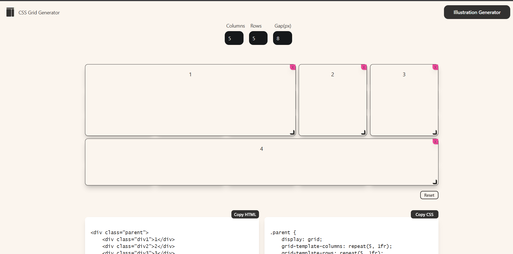

# This is a list of useful sites for developers

# and programmers to find resources, tools, and communities.

## Ui/UX Design
#### 1. [CSS Grid Generator](https://cssgridgenerator.io/)
 

  ##### This website, CSS Grid Generator, helps users:
* Visually create custom CSS grid layouts.
* Specify the number of columns, rows, and gutter sizes.
* Interactively customize layouts by adding, resizing, and repositioning elements.
* Generate and copy the corresponding HTML and CSS code for their projects.