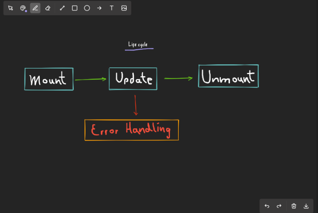

# This is a list of useful sites for developers

# and programmers to find resources, tools, and communities.

## Ui/UX Design
#### 1. [CSS Grid Generator](https://cssgridgenerator.io/)
 

  ##### This website, CSS Grid Generator, helps users:
* Visually create custom CSS grid layouts.
* Specify the number of columns, rows, and gutter sizes.
* Interactively customize layouts by adding, resizing, and repositioning elements.
* Generate and copy the corresponding HTML and CSS code for their projects.

## vsCode Extensions

#### 1. [hall.draw](https://marketplace.visualstudio.com/items?itemName=hall.draw)

##### This extension, hall.draw, helps users:

* Open a file (in a supported format) and run Draw: Edit Current Line by either

  * right clicking on the line or
  * opening the command palette (F1 or Ctrl-Shift-P) and type draw edit

* The currently supported formats are

  * markdown
  * asciidoc
  * restructuredtext

#### 2. [freedraw](https://marketplace.visualstudio.com/items?itemName=ProjectSyntax.freedraw)

* How It Works
  * Installation: Install the FreeDraw extension from the Visual Studio Code marketplace.
  * Activation: Activate the extension using the command palette (Ctrl+Shift+P) and typing Free Draw.
  * Drawing: Use your mouse or stylus to draw on the editor. You can change colors, brush sizes, and more from the toolbar.
  * Saving: Save your drawings as images by clicking the save button in the toolbar.